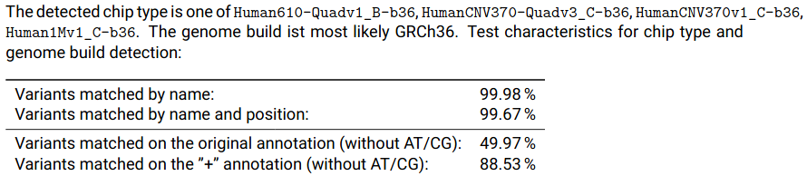

# GWAS Quality Control Pipeline User Manual

## Prerequisites
- Nextflow: https://www.nextflow.io/
- Java 8 or higher
- Singularity 3.4 or higher
- A to-be-QCed dataset in Plink format (bim/bed/fam). You can use the included example for test runs.

Please ensure that you have 16 GB RAM installed on the computer where you intend to run the pipeline (i.e. your local computer or your HPC compute nodes).

Note that no separate installation of the pipeline software is necessary. During Nextflow's first launch, required scripts and containers are automatically downloaded and installed locally into a cache folder. If the current version on Github is updated, Nextflow prints a notice that the local copy is outdated. In that case, the local copy can be updated using `nextflow pull ikmb/gwas-qc`.

## Quick Start

1. Get the example dataset: https://raw.githubusercontent.com/ikmb/gwas-qc/master/example.tar.gz
   - Note that the example also contains files that will not be used by the QC, but for later marker association testing
   - The example dataset is a subset of the 1000 Genomes Project, using 2504 samples with randomized sex and phenotype, and 50,000 randomly-selected variants
3. Unpack it in your home folder: `tar xvaf example.tar.gz -C $HOME; cd $HOME/example`
4. Launch the pipeline: `nextflow run -c pipeline.config ikmb/gwas-qc`
5. (optional) use the QC output directly as input to the [Association Testing Pipeline](https://github.com/ikmb/gwas-assoc)

The pipeline output and reports will be written to the `output` directory.

## How to use

In most cases, the example configuration consisting of three files, `QC.config`, `dataset.config` and `pipeline.config` can be used for your own dataset with only minor changes. The file `pipeline.config` describes extrinsic parameters, i.e. where your input files are, etc. The file `dataset.config` contains dataset-specific information, i.e. the target name of the dataset, the expected diagnoses and various configurable threshold parameters to the QC process. The last file, `QC.config`, configures the runtime parameters such as allocated memory on HPC clusters, wallclock time allowance. To prepare your own dataset, perform the following steps:

1. Create a new directory to host your configuration and results
2. Copy the aforementioned configuration files to your newly-created directory
3. Adjust the names and locations of datasets and config files in your `pipeline.config`. Note that absolute path names are required, relative names are not supported.
4. Change the items `collection_name` and `allowed_diagnoses` in your dataset.config according to your data. The collection name is the name prefix that will be used for output files and is arbitrary, as long as it would be a valid filename. The `allowed_diagnoses` key is used to specify which samples to filter based on specified diseases in case you have a multi-disease dataset. Disease names are arbitrary but should not contain whitespaces.
5. Create individual annotations (see below) for your dataset and place it among your source files. If your source files are named `MyGWAS.bim/bed/fam`, the annotations are expected to be in `MyGWAS_individuals_annotation.txt`.
6. Run the pipeline with `nextflow run -c pipeline.config ikmb/gwas-qc`

### Individual Annotations

For a proper analysis of batch and principal component effects, the pipeline makes use of certain sample information that you need to supply in a text file. It contains a single header line and one line for each sample in your dataset. **The columns are separated by tab characters.** The format is as follows:
```
familyID    individualID	paternalID	maternalID	sex	phenotype	batch	ethnicity_predicted	diagnosis	country
HG00096	    HG00096	        0	        0               2       2	        1000G	European	        Control	        Somewhere
HG00097	    HG00097	        0	        0	        1	2	        1000G	European	        Control	        Somewhere
HG00099	    HG00099	        0	        0	        2	2	        1000G	European	        Control	        Somewhere
HG00100	    HG00100	        0	        0       	1	1	        1000G	European	        Case	        Somewhere
HG00101	    HG00101	        0	        0	        2	1	        1000G	European	        Case	        Somewhere
HG00102	    HG00102	        0	        0	        2	2	        1000G	European	        Control	        Somewhere
```

* familyID, individualID, paternalID, maternalID: can be copied from the Plink FAM file. The `individualID` must be unique. `paternalID` and `maternalID` are required but are currently not used.
* sex, phenotype: same encoding as in the FAM file. For sex, 1/2 is male/female and for phenotype, 1/2 is control/case.
* batch: used by principal component analysis to find batch effects. Can be set to the same value for all samples if you only have one batch
* ethnicity_predicted: used to provide a reference frame for PCA plots. Currently, only `European` is supported
* diagnosis: if the `phenotype` is 1, this should be control. Otherwise, pick a disease name for the cases. This is used in PCA effect analysis and diagnosis filtering (see "How to use")
* country: the probably self-reported origin of the sample. Is used in PCA to show batch effects

Note that empty lines or comment lines are currently not supported.

### Non-hg19 Data and Liftover to hg19 (pre-QC)

Currently, the pipeline requires working on hg19 data. It is, however, possible to semi-automatically convert your hg18 (genome build 36) or hg38 coordinates to hg19 (genome build 37) prior to any actual QC steps. For this step to be possible, it is required that your input datasets are as original as possible regarding the microarray definition. If the input batches are already merged with other data or the variant names have been changed, the process is likely to fail.

If you already started the QC with non-hg19 input, the resulting data should not be used. The report will show valuable information about the detected chip type and will help choosing the appropriate definition file for lifting over. Each batch will have a subsection called "Annotation Overview" where this information is contained:


As shown in the screenshot, several chips have been found to almost exactly match the input data. As they all performed equally, it does not matter which one you choose. For this example we choose `Human610-Quadv1_B`. To configure the QC pipeline to convert this batch to b37, you need to specify the chip in your `pipeline.config`. Consult the [full list of supported chips](https://github.com/ikmb/gwas-qc/blob/master/doc/supported-chips.txt) for possible values:

```
dataset_prefixes['Some_Demo_Dataset'] = ["/home/user/oldbatch", "/home/user/otherbatch"]

batch_liftover['oldbatch'] = "Human610-Quadv1_B"    // lift batch to build 37
batch_liftover['otherbatch'] = ""                   // no liftover for this batch
```

In the configuration file, the keys in the dictionary `batch_liftover` specify the base names of the datasets set in `dataset_prefixes`. 

After liftover, the report shows a short summary about the success (or failure) of the liftover process.

### Post-QC Liftover to hg38 (and others)

In addition to the regular GRCh37 (hg19) output, the QC pipeline offers automatic conversion to hg38. Due to licensing issues, the required tools are not included in this distribution and as such, this functionality is disabled by default. If you would like to use this feature, you will need to download the [UCSC LiftOver program for Linux](https://genome-store.ucsc.edu/), the chain file [`hg19ToHg38.over.chain.gz`](http://hgdownload.cse.ucsc.edu/goldenPath/hg19/liftOver/) and the _unpacked_ [UCSC hg38 reference `hg38.fa.gz`](http://hgdownload.cse.ucsc.edu/goldenPath/hg38/bigZips/). 

The target directory should now contain the following files:

```
liftOver                 # needs to be executable: chmod a+x liftOver
hg19ToHg38.over.chain.gz
hg38.fa                  # obtain using: gunzip hg38.fa.gz
```

Open your dataset's `QC.config` and set the following parameter to the path where the above files reside:
```
params.ucsc_liftover = "/home/user/ucsc-liftover-data"
```


The pipeline process automatically detects the presence of the UCSC liftover tools and adds a hg38 conversion step to the pipeline.

### Principal Component Analysis with HapMap

By default, the QC pipeline performs a Principal Component Analysis with a 1000 Genomes Reference. It is possible to include an additional analysis using the HapMap2 reference for PCA by adding the parameter `--activate_hapmap_pca=1` to the Nextflow call. This additional PCA will not contribute to the actual outcome but will add HapMap2 PCA plots to the final report.

It is not recommended to use this feature for large datasets, e.g. >50,000 samples.

## Advanced Configuration

### Local and Side-wide Configuration

You can extend the Nextflow default configuration by using (or creating) the following configuration files:
- a `nextflow.config` in the current working directory. This file is automatically read if Nextflow is launched from this folder.
- a site-wide `$HOME/.nextflow/config`. This file is automatically read every time you run Nextflow.

It is usually a good idea to place additional configuration items to the side-wide configuration (see below for examples).

### Shared Singularity Cache

In a shared compute enviroment such as HPC clusters, it is often useful to share the singularity cache with other Nextflow/Singularity users so they would not have to download the same large files over and over again. To specify the singularity cache directory, add the following line to your config:
```
singularity.cacheDir = '/some/shared/place/singularity'
```
Note that the directory must be accessible from all compute nodes.

### HPC Resources and Job Queues

By default, all processes are launched on the computer where the QC is started. This is usually not appropriate on HPC login nodes where jobs should be sheduled on different nodes. Nextflow provides support for a broad range of job submission systems, such as SLURM, SGE or PBS/Torque. Please review the [Nextflow documenation on compute resources](https://www.nextflow.io/docs/latest/executor.html).

For example, if you intend to use a SLURM environment, place the following code in your config (see "Shared Singularity Cache"):
```
process.executor = "slurm"
executor.queue = "partition-name"  // optional
executor.queueSize = 150           // optional, override max queue length for Nextflow
process.clusterOptions = '--qos=someval' // optional, if you need to supply additional args to sbatch
```

### Limited Temporary Space

This pipeline makes heavy use of temporary storage. By default, Nextflow will store them in a folder called `work` within your current working directory. If your local storage is limited and/or you need to store the temporary files in a different place, you can
- call Nextflow/the start script from a place with enough available storage. The config files do not need to be in the current working directory, or
- set the environment variable `NXF_WORK` to a different directory. The default value is `NXF_WORK=$(pwd)/work`. A good place for this setting is your shell startup file (e.g. `.bashrc` or `.zshrc`, don't forget to `source` it or re-login to make it work). For a quick test, you can also just temporarily `export NXF_WORK=/some/other/place` before running the pipeline.

The example dataset that comes with this package requires at least 620 MB temporary store space and additional 385 MB result storage.

### Mounting Paths into the Singularity Container

To separate the operating system within the singularity container from the host system, Singularity only makes your home folder accessible to the insides. If your data files are stored in a directory different from your home (e.g. a shared storage `/data_storage`), you will need to explicitly make it accessible by specifying additional singularity options in your config file:
```
singularity.runOptions = "-B /data_storage -B /some_other_storage -B /even_more_storage"
```

### Cache Issues

Some users have experienced error messages that read like:
```
FATAL: Cached File Hash(...) and Expected Hash(...) does not match
```

When Nextflow is run on a grid computing/cluster platform, it makes heavy and parallel use of shared storage among the involved nodes. If the filesystem that is used on this shared storage cannot guarantee cache coherency, Nextflow might run into race conditions leading to the above error. Removing the `$NXF_WORK` or `work` directory and/or moving them to a different filesystem might help with the issue. Almost all of these errors that are known to us have happened on directories that are mounted via SMB/CIFS. It has successfully and thoroughly been tested with NFS and BeeGFS.

If you absolutely must use a SMB/CIFS share as the pipeline working directory, you could try setting `process.cache = 'deep'` in your `nextflow.conf` (see above for suitable config file locations). This will make Nextflow's caching behavior considerably slower.

### UKSH medcluster configuration

For optimal configuration on the UKSH medcluster, perform the following configuration changes (you only need to do this once):

Create or change your `$HOME/.nextflow/config` file:
```
// use pre-populated singularity image cache
singularity.cacheDir = "/work_ifs/sukmb388/singularity-cache"

// bind /work_ifs folders. If you need more than $HOME and work_ifs, add another "-B /somewhere" switch.
singularity.runOptions = "-B /work_ifs"

// make nextflow use slurm by default
profiles {
    standard {
        executor.name = "slurm"
        executor.queueSize = 150
        process.executor = "slurm"
        process.queue = "all"
    }
}
```

Before launching the pipeline, please assure that the proper modules are loaded: `module load nextflow singularity`. Java should be loaded automatically as a dependency of Nextflow.

## License

MIT License

Copyright (c) 2020 Institute of Clinical Molecular Biology

Permission is hereby granted, free of charge, to any person obtaining a copy
of this software and associated documentation files (the "Software"), to deal
in the Software without restriction, including without limitation the rights
to use, copy, modify, merge, publish, distribute, sublicense, and/or sell
copies of the Software, and to permit persons to whom the Software is
furnished to do so, subject to the following conditions:

The above copyright notice and this permission notice shall be included in all
copies or substantial portions of the Software.

THE SOFTWARE IS PROVIDED "AS IS", WITHOUT WARRANTY OF ANY KIND, EXPRESS OR
IMPLIED, INCLUDING BUT NOT LIMITED TO THE WARRANTIES OF MERCHANTABILITY,
FITNESS FOR A PARTICULAR PURPOSE AND NONINFRINGEMENT. IN NO EVENT SHALL THE
AUTHORS OR COPYRIGHT HOLDERS BE LIABLE FOR ANY CLAIM, DAMAGES OR OTHER
LIABILITY, WHETHER IN AN ACTION OF CONTRACT, TORT OR OTHERWISE, ARISING FROM,
OUT OF OR IN CONNECTION WITH THE SOFTWARE OR THE USE OR OTHER DEALINGS IN THE
SOFTWARE.
